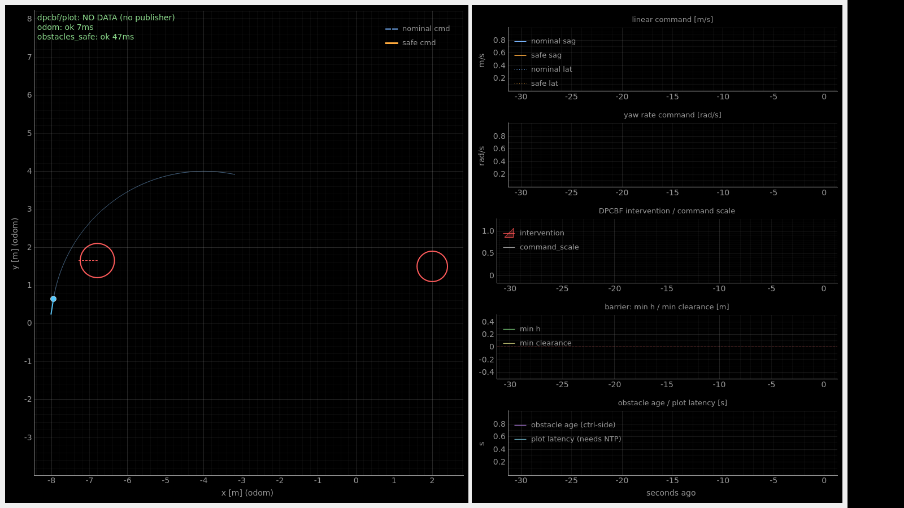
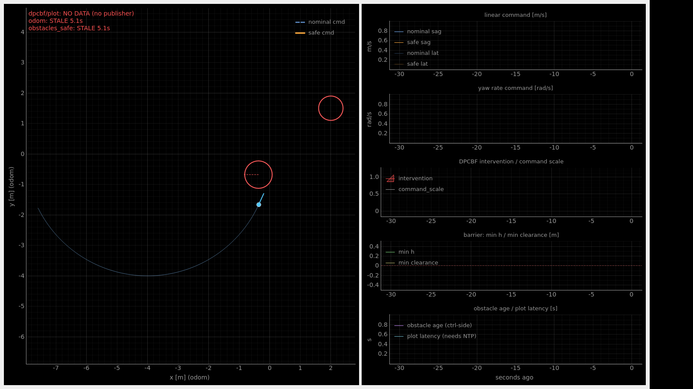

# G1 실기 실험 매뉴얼 — Fast DDS 링크 (Computer 2 ↔ Computer 3)

**대상**: 2026-08-11 실험. 어제(08-07) 세션에서 **Computer 2 ↔ Computer 3
통신이 전혀 되지 않았던 것**과 **빌드가 Foxy/Humble 양쪽에서 실패했던 것**을
고친 판입니다.

## 이 문서의 목표 — Computer 3 화면에 **라이브 플롯을 띄워 두는 것**

Computer 3을 준비한 이유는 하나입니다: **로봇이 추정한 장애물을 노트북 화면에서
실시간으로 보는 것.** 이 문서를 끝까지 따라가면 아래 창이 노트북에 떠 있고,
로봇 앞을 사람이 지나갈 때 **원이 같이 움직입니다.**



| 화면에 라이브로 그려지는 것 | 출처 | 갱신 |
|---|---|---|
| 로봇 위치 · heading · 지나온 trail | `/odom` | 100 Hz 수신, 25 Hz 렌더 |
| **장애물 원** (중심 = 추정 위치, 반지름 = 추정 반지름) | `/obstacles_safe` | 10 Hz |
| **장애물 속도 화살표** (1초 뒤 위치) | `/obstacles_safe` | 10 Hz |
| 좌상단 배너 (`ok` / `STALE` / 소스별 나이) | 수신 시각 | 매 프레임 |

**2026-08-10에 이 그림을 실제로 재현해서 검증했습니다** — Foxy가 Fast DDS로
보낸 토픽을 문서에 적힌 그 명령(`ros2 launch dpcbf_plot_client
dpcbf_plot_client.launch.py`)으로 띄운 pyqtgraph 창에서, 32초 동안 로봇과
장애물이 계속 움직이는 것을 스크린샷 3장으로 확인했습니다 (§7).

> **오른쪽 시계열 5개는 이번 세션에서 빈 화면이 정상입니다.** 그것은 장애물
> 플롯이 아니라 **제어기 내부값**(`/dpcbf/plot`: nominal/safe command,
> intervention, min_h)이고, 로봇에는 DPCBF control seam이 아직 없습니다.
> **왼쪽 화면 = 이번 실험의 본체**이고 그것은 전부 동작합니다.

---

**무엇이 바뀌었나 (한 줄)**: 미들웨어를 **CycloneDDS → Fast DDS
(`rmw_fastrtps_cpp`)** 로 바꿉니다. Fast DDS는 **Foxy와 Humble의 기본
미들웨어**라 어느 쪽에도 새로 설치할 것이 없고, NIC 이름을 설정할 필요가
없으며, XML 파일이 아예 없어도 동작합니다. 어제 실패한 원인 4개 중 3개가
이것만으로 사라집니다.

> 기존 [`g1_two_computer_setup.md`](g1_two_computer_setup.md)는 **여전히
> 유효**합니다 — LiDAR IP 찾기(A-7), `MID360_config.json` 채우기(A-8),
> preflight(A-10), 단계별 기동(A-11), Foxy 주의사항(A-12)은 그대로
> 쓰십시오. 이 문서는 그 문서의 **A-9 / B-5 / Part C (네트워크·연결 부분)를
> 대체**하고, 터미널 운용을 처음부터 다시 씁니다.

---

## 목차

- [0. 어제 왜 안 됐는가 — 원인 4개](#0-어제-왜-안-됐는가--원인-4개)
- [1. 터미널을 어떻게 띄우는가 (완전판)](#1-터미널을-어떻게-띄우는가-완전판)
- [2. Computer 2 준비](#2-computer-2-준비-g1-온보드-foxy)
- [3. Computer 3 준비](#3-computer-3-준비-노트북-humble)
- [4. 링크 확인 — 3단계](#4-링크-확인--3단계-여기서-멈추고-반드시-통과시킬-것)
- [5. 실험 실행 시트](#5-실험-실행-시트-복붙용)
- [6. 문제 해결](#6-문제-해결)
- [7. 부록 — 이 문서의 근거 (2026-08-10 실측)](#7-부록--이-문서의-근거-2026-08-10-실측)

---

## 0. 어제 왜 안 됐는가 — 원인 4개

### 원인 ①  `~/.g1_viz_env`는 **그 자체로는 아무 일도 하지 않는 파일**이었다

지적하신 것이 정확합니다. 확인 결과:

```
ros2/src/.../scripts/viz_env_computer2.sh:88
    export ROS_DOMAIN_ID="$G1_VIZ_DOMAIN_ID"
```

번역해 주는 코드는 **존재합니다**. 다만 그 코드는
`viz_env_computer2.sh`를 `source` 했을 때만 실행됩니다.
`~/.g1_viz_env`를 읽는 곳은 저장소 전체에서
`viz_env_computer2.sh:32` / `viz_env_computer3.sh:20` **두 줄뿐**입니다.

즉 `cat > ~/.g1_viz_env` 만 하고 끝내면:

| 변수 | ROS가 읽는가 |
|---|---|
| `G1_VIZ_DOMAIN_ID=7` | ❌ ROS에 그런 변수는 없음 → **도메인은 계속 0** |
| `G1_VIZ_IFACE=wlan0` | ❌ CycloneDDS XML을 고를 때만 쓰임 |
| `G1_VIZ_PEER=...` | ❌ 동일 |

그리고 이 상태는 **에러가 나지 않습니다.** `ros2 topic list`도 정상으로
보이고 노드도 잘 뜹니다. 두 컴퓨터가 서로 다른 도메인에 있을 뿐입니다.

**이번 판의 수정**: 환경 파일에 **ROS가 직접 읽는 이름만** 씁니다.

```bash
export ROS_DOMAIN_ID=7            # ROS가 아는 이름
export RMW_IMPLEMENTATION=rmw_fastrtps_cpp
export ROS_LOCALHOST_ONLY=0
```

파일을 `source` 하는 것만으로 링크에 올라갑니다. **번역 스크립트가
없어도 동작합니다.** 그리고 `~/.bashrc`에서 이 파일을 읽게 해서, 새 터미널·새
tmux pane에서 **잊어버릴 수 없게** 만듭니다 (§2-1).

### 원인 ②  `viz_env_computer2.sh`를 source 해도 조용히 실패했을 가능성이 높다

이 스크립트는 `source` 되는 스크립트라서, 실패해도 **셸이 죽지 않고 다음
명령으로 넘어갑니다.** 실패 경로가 셋입니다:

| 실패 지점 | 증상 |
|---|---|
| `ip link show wlan0` 실패 (스크립트 83행) | `interface 'wlan0' does not exist` 한 줄만 뜨고 **아무 변수도 export 되지 않음**. G1 Jetson의 무선 NIC은 `wlan0`이 아닐 수 있습니다 |
| `RMW_IMPLEMENTATION=rmw_cyclonedds_cpp` (87행)인데 그 rmw가 없음 | 이후 **모든** `ros2` 명령이 `failed to load rmw implementation`로 죽음 |
| XML의 `<Interfaces>` 문법 | CycloneDDS **0.9 이상**에서만 인식. 로드된 `libddsc`가 `/opt/ros/foxy`의 0.7이면 설정 파싱 에러로 노드가 죽음 |

Fast DDS 판에는 **NIC 이름 자체가 없습니다.** Fast DDS는 올라와 있는 모든
인터페이스를 씁니다. `wlan0` vs `wlp2s0` 문제가 구조적으로 사라집니다.

### 원인 ③  `ros2 daemon` 캐시 — "분명 켰는데 토픽이 안 보임"

오늘 검증 중에 실제로 겪은 것입니다. `ros2 topic list` / `ros2 node list`는
백그라운드 `ros2 daemon`에게 물어보는데, 이 daemon은 **처음 뜰 때의
`ROS_DOMAIN_ID` / `RMW_IMPLEMENTATION`을 기억**합니다. 환경을 바꾼 뒤에도
옛날 daemon이 살아 있으면 **빈 그래프를 보고**하고, 실제로는 데이터가 잘
흐르고 있어도 알 수 없습니다.

```bash
ros2 daemon stop        # 환경을 바꿨으면 반드시
# 또는
ros2 topic list --no-daemon
```

이 문서의 확인 명령은 전부 `--no-daemon`을 씁니다.

### 원인 ④  빌드 — Foxy와 Humble이 서로 다른 이유로 깨졌다

| 컴퓨터 | 깨진 것 | 진짜 원인 | 이번 판의 처리 |
|---|---|---|---|
| **C2 (Foxy)** | `cyclonedds` 패키지 빌드 중 `idlc`가 `undefined symbol: DDS_XTypes_TypeObject_desc`로 죽음 | 워크스페이스는 CycloneDDS **0.10.2**를 빌드하는데 `LD_LIBRARY_PATH`에 있는 `/opt/ros/foxy`의 **0.7** `libddsc`가 먼저 로드됨 | **CycloneDDS를 아예 빌드하지 않습니다.** Fast DDS를 쓰므로 필요 없습니다 |
| **C2 (Foxy)** | `rmw_cyclonedds_cpp` 소스 빌드 불가 | foxy 브랜치는 0.7 API, humble 브랜치는 Foxy에 없는 헤더 요구 | 동일 — **빌드하지 않습니다** |
| **C3 (Humble)** | 6개만 select → `g1_perception_bringup`에서 `install/share/<pkg>/package.sh` 없음 | `g1_perception_bringup`의 `exec_depend`가 `g1_description`/`g1_perception_utils`/`sim_mjlidar_bridge`를 끌고, 그것들이 다시 `dpcbf_ros_adapter`/`sim_msgs`/`yaml-cpp`를 끔 | **`g1_perception_bringup`을 C3에서 빼버립니다.** 그것을 쓴 이유는 CycloneDDS XML과 `viz_env_computer3.sh` 때문이었는데 둘 다 필요 없어졌습니다 → **3개만 빌드** |

결과:

| | 어제 | 오늘 |
|---|---|---|
| Computer 2 빌드 | 18개 (+ `~/cyclonedds_ws` underlay 전제) | **15개**, underlay 전제 없음 |
| Computer 3 빌드 | 11개 | **3개** (실측 16초) |

> **현장 수정본은 저장소에 반영되어 있습니다.** 커밋 `e20f662`("8/7experiment")에
> ① `MID360_config.json`의 실제 IP (host `192.168.123.164`, LiDAR
> `192.168.123.120`), ② `perception.launch.py`의 `frame_id: odom` /
> `transform_coordinates: true` 인라인 오버라이드(Foxy에서 컴포넌트의
> 파라미터 파일 오버라이드가 조용히 무시되는 것에 대한 대응)가 들어 있습니다.
> **빌드를 고친 수정은 코드가 아니라 `colcon` 인자였고**, 그건 문서에만
> 반영돼 있었습니다 — 그래서 이번에 위 표대로 다시 정리했습니다.

---

## 1. 터미널을 어떻게 띄우는가 (완전판)

어제 가장 고생하신 부분입니다. 아래 그대로만 하십시오.

### 1.1 이 실험에 필요한 터미널

| | 어디 | 몇 개 | 무엇 |
|---|---|---|---|
| **T1** | Computer 3 (노트북) | 1 | Computer 2로 SSH → 여기서 스택을 띄움 |
| **T2** | Computer 3 | 1 | Computer 2로 SSH → 점검용 (`topic hz` 등) |
| **T3** | Computer 3 | 1 | Computer 2로 SSH → bag 녹화 |
| **T4** | Computer 3 | 1 | **노트북 자기 자신**에서 링크 확인 |
| **T5** | Computer 3 | 1 | **노트북 자기 자신**에서 GUI 플롯 클라이언트 |

총 5개. T1~T3는 Computer 2에, T4~T5는 Computer 3에 있습니다.

### 1.2 노트북에서 터미널 새로 여는 법

- **`Ctrl` + `Alt` + `T`** → 새 터미널 창 하나
- 이미 열린 터미널에서 **`Ctrl` + `Shift` + `T`** → 새 탭
- 탭 이동: **`Alt` + `1`, `Alt` + `2`, …**

**터미널 5개를 그냥 5번 열면 됩니다.** tmux를 꼭 써야 하는 것은 아닙니다.

### 1.3 Computer 2에 SSH로 붙는 법

```bash
# [Computer 3의 터미널에서]
ssh -o ServerAliveInterval=15 -o ServerAliveCountMax=4 unitree@<Computer2의 IP>
```

- `ServerAliveInterval` 옵션은 Wi-Fi가 잠깐 끊겨도 세션이 죽지 않게 합니다.
- 접속되면 프롬프트가 `unitree@...` 로 바뀝니다. **이걸로 "지금 어느
  컴퓨터에 있는지"를 항상 확인하십시오.**

```bash
hostname          # 지금 내가 어느 컴퓨터에 있는지 (헷갈리면 언제나 이것)
```

### 1.4 tmux — **스택을 띄우는 T1에는 쓰는 것을 권장**

SSH가 끊기면 그 터미널에서 돌던 프로세스는 **같이 죽습니다.** perception
스택(T1)과 bag 녹화(T3)는 그러면 실험이 날아갑니다. tmux 안에서 돌리면
SSH가 끊겨도 **서버 쪽에 살아 있고**, 다시 붙으면 그대로 이어집니다.

```bash
# [Computer 2에 SSH로 들어온 직후]
tmux new -s g1          # 'g1'이라는 세션 생성 + 진입
```

화면 아래에 초록색 상태줄이 생기면 tmux 안입니다.

| 하고 싶은 것 | 키 |
|---|---|
| tmux에서 **빠져나오기** (프로세스는 계속 돎) | `Ctrl-b` 누르고 손 뗀 뒤 `d` |
| 다시 **들어가기** | `tmux attach -t g1` |
| 세션 목록 | `tmux ls` |
| 창 가로 분할 | `Ctrl-b` → `"` |
| 창 세로 분할 | `Ctrl-b` → `%` |
| pane 이동 | `Ctrl-b` → 방향키 |
| pane 번호 표시 | `Ctrl-b` → `q` |
| 현재 pane 닫기 | 그 pane에서 `exit` |
| 세션 통째로 죽이기 | `tmux kill-session -t g1` |

> **`Ctrl-b`는 "동시에"가 아닙니다.** `Ctrl`+`b`를 눌렀다 **떼고**, 그 다음에
> `"`나 `%`나 방향키를 누릅니다.

> ⚠ **tmux의 함정 하나**: 새 pane은 **tmux 서버가 처음 시작될 때의 환경**을
> 물려받습니다. 그래서 pane마다 `source`를 다시 해 줘야 합니다 — 이번 판은
> §2-1에서 `~/.bashrc`에 넣기 때문에 **새 pane도 자동으로 환경을 갖습니다.**
> 다만 워크스페이스 `install/setup.bash`는 여전히 pane마다 필요합니다.

### 1.5 헷갈리지 않는 규칙 3개

1. 명령을 치기 전에 **`hostname`** — 지금 C2인지 C3인지.
2. 명령을 치기 전에 **`pwd`** — 이 문서의 모든 블록은 실행 디렉토리를
   명시합니다.
3. 새 터미널/새 pane을 열었으면 **§2-3 (C2) 또는 §3-3 (C3)의 "3줄 블록"을
   먼저 붙여넣기.**

### 1.6 ★ 두 컴퓨터에서 **같아야 하는 값 / 달라야 하는 값**

`~/.g1_net_env`는 **머신마다 따로** 만듭니다. 같은 파일을 복사해서 쓰면 안 되는
줄이 있습니다.

| 변수 | Computer 2 (G1 온보드) | Computer 3 (노트북) | |
|---|---|---|---|
| `ROS_DOMAIN_ID` | `7` | `7` | **반드시 같음** — 다르면 서로를 못 봅니다 |
| `RMW_IMPLEMENTATION` | `rmw_fastrtps_cpp` | `rmw_fastrtps_cpp` | **반드시 같음** — 벤더가 다르면 절대 안 통합니다 |
| `ROS_LOCALHOST_ONLY` | `0` | `0` | 둘 다 0 |
| **`G1_WS`** | `/home/unitree/dyros_ws/sanghyuk_ws/unitree_rl_mjlab/ros2` (08-07 현장 값) | 노트북에 clone한 경로 (예: `/home/<user>/unitree_rl_mjlab/ros2`) | **다릅니다.** 각 머신에서 실제 경로를 확인해서 넣을 것 |
| **`G1_PEER_IP`** | Computer **3**의 IP | Computer **2**의 IP | **서로 반대입니다.** peers 모드(§4-2)에서만 필요 |

> `G1_WS`는 ROS 변수가 아니라 이 문서의 복붙 블록을 짧게 쓰기 위한 것입니다.
> 틀려도 DDS는 멀쩡하지만 `cd`가 실패해서 엉뚱한 디렉토리에서 명령이 돕니다 —
> 각 절의 확인 명령(`ls "$G1_WS/deps.repos"`)을 꼭 거치십시오.

---

## 2. Computer 2 준비 (G1 온보드, Foxy)

> 저장소 경로가 기본과 다릅니다. 08-07 현장 머신은
> `/home/unitree/dyros_ws/sanghyuk_ws/unitree_rl_mjlab` 였습니다
> (커밋 `e20f662`의 `.vscode/settings.json`에 남아 있는 값).
> 아래에서는 `$G1_WS`로 씁니다 — §2-1에서 한 번 정의하고, **Computer 3의
> 값과는 다릅니다** (§1.6).

### 2-1. 환경 파일 만들기 (**어제 실패한 부분**)

**터미널: T1 / 실행 위치: 홈 디렉토리**

**먼저 이 머신의 실제 경로를 확인**하십시오 (추측하지 말 것):

```bash
cd /home/unitree/dyros_ws/sanghyuk_ws/unitree_rl_mjlab/ros2 && pwd
# 경로가 다르면:
find /home -maxdepth 6 -name deps.repos -path "*/ros2/*" 2>/dev/null
```

찍힌 경로를 아래 `G1_WS`에 넣습니다:

```bash
cd ~
cat > ~/.g1_net_env <<'EOF'
export ROS_DOMAIN_ID=7
export RMW_IMPLEMENTATION=rmw_fastrtps_cpp
export ROS_LOCALHOST_ONLY=0
unset CYCLONEDDS_URI
export G1_WS=/home/unitree/dyros_ws/sanghyuk_ws/unitree_rl_mjlab/ros2   # ★ 위에서 확인한 값
#export G1_PEER_IP=192.168.0.xxx     # Computer 3의 IP. §4-2에서 필요하면 켬
EOF
```

확인:

```bash
source ~/.g1_net_env
ls "$G1_WS/deps.repos" && ls -d "$G1_WS/install"   # 둘 다 보여야 함
```

`No such file or directory`가 나오면 `G1_WS`가 틀린 것입니다. 그대로 진행하면
이후 모든 `cd "$G1_WS"`가 실패하고, 엉뚱한 디렉토리에서 `source
install/setup.bash`가 돌아 **"빌드했는데 패키지가 없다"** 로 보입니다.

**이제 `~/.bashrc` 맨 아래에 한 줄 추가** — 이래야 새 터미널/새 pane에서
잊어버릴 수 없습니다:

```bash
echo '[ -f ~/.g1_net_env ] && . ~/.g1_net_env' >> ~/.bashrc
```

적용 확인 (**새 터미널을 하나 열어서**):

```bash
printenv ROS_DOMAIN_ID RMW_IMPLEMENTATION ROS_LOCALHOST_ONLY
```

세 줄이 나와야 합니다:
```
7
rmw_fastrtps_cpp
0
```

> ⚠ **`RMW_IMPLEMENTATION`을 `.bashrc`에 넣는 것의 부작용**: 이 머신에서
> CycloneDDS를 쓰는 **다른 ROS 작업**(`unitree_ros2` 같은 것)이 있으면 그
> 작업도 Fast DDS로 뜨게 됩니다. `unitree_sdk2`(C++ SDK) 자체는 ROS를 거치지
> 않으므로 **영향 없습니다.** 되돌리려면 `~/.bashrc`의 그 줄을 지우면 됩니다.

### 2-2. 코드 업데이트 + 재빌드 (bringup만, 1분)

**터미널: T1 / 실행 위치: `$G1_WS`**

```bash
cd "$G1_WS"
git pull
source /opt/ros/foxy/setup.bash
colcon build --packages-select g1_perception_bringup
```

이번 커밋에서 바뀐 것: `g1_hw_preflight.sh`가 **`rmw_fastrtps_cpp`를 허용**하고
(어제는 `rmw_cyclonedds_cpp`가 아니면 HARD FAIL이라 preflight를 통과할 수
없었습니다), `net_env.sh` / `g1_link_check.sh`가 추가됐습니다.

### 2-3. **모든 새 터미널/pane에서 붙여넣는 3줄 블록**

```bash
cd "$G1_WS"
source /opt/ros/foxy/setup.bash
source install/setup.bash
```

확인 (한 줄 더):
```bash
printenv ROS_DOMAIN_ID RMW_IMPLEMENTATION ROS_LOCALHOST_ONLY | tr '\n' ' '; echo
```
→ `7 rmw_fastrtps_cpp 0` 이 나와야 합니다. 안 나오면 §2-1이 안 된 것입니다.

### 2-4. 처음부터 다시 빌드해야 할 때만 — **15개 패키지**

> **이미 빌드가 되어 있으면 이 절은 건너뛰십시오.** 어제 성공한 빌드는 그대로
> 유효합니다.

**실행 위치: `$G1_WS`**

```bash
cd "$G1_WS"
source /opt/ros/foxy/setup.bash        # ★ 다른 워크스페이스는 source 금지

colcon build \
    --packages-skip cyclonedds rmw_cyclonedds_cpp unitree_sdk2 \
                    unitree_dds_wrapper_vendor t10_dds_coexistence \
    --cmake-args -DCMAKE_BUILD_TYPE=RelWithDebInfo
```

```
Summary: 15 packages finished
```

빠지는 5개와 그 이유:

| 뺀 패키지 | 왜 빼도 되는가 |
|---|---|
| `cyclonedds`, `rmw_cyclonedds_cpp` | Fast DDS를 씁니다. 어제 Foxy 빌드를 깨뜨린 바로 그 둘입니다 |
| `unitree_sdk2`, `unitree_dds_wrapper_vendor` | perception 경로에서 아무도 링크하지 않습니다 (쓰는 곳은 `t10_dds_coexistence`와 시뮬레이터뿐) |
| `t10_dds_coexistence` | CycloneDDS 공존 게이트. Fast DDS를 쓰면 검사 대상 자체가 없습니다 |

> 동등한 표현: `colcon build --packages-up-to g1_perception_bringup
> safety_obstacle_filter dpcbf_plot_client livox_ros_driver2
> direct_lidar_inertial_odometry pcl_ros pointcloud_to_laserscan`

> **`ros-foxy-rmw-cyclonedds-cpp` deb도 이제 필요 없습니다.** 어제 apt 목록에서
> 이것 때문에 EOL 저장소를 건드려야 했다면, 이번에는 그 줄을 빼도 됩니다.

### 2-5. Preflight

**터미널: T1 / 실행 위치: `$G1_WS`**

```bash
cd "$G1_WS"
# (§2-3의 3줄 블록 먼저)
./src/g1_perception/g1_perception_bringup/scripts/g1_hw_preflight.sh
echo "EXIT=$?"
```

`§1. ROS 2 environment`에서 이번 판에 새로 나오는 줄:

```
    ok   RMW_IMPLEMENTATION=rmw_fastrtps_cpp
    ROS_DOMAIN_ID=7
    ok   ROS_LOCALHOST_ONLY=0
```

> `ros2 run`이 **아니라 소스 트리 경로**로 실행하는 이유는 기존 문서 A-10
> 그대로입니다 (§4 config_diff와 §7 extrinsic guard가 설치 레이아웃에서
> 오탐합니다).

---

## 3. Computer 3 준비 (노트북, Humble)

### 3-1. 환경 파일 (C2와 **같은 도메인**, **다른 경로**)

**터미널: T4 / 실행 위치: 홈 디렉토리**

> ⚠ **`G1_WS`는 §2-1의 Computer 2 값을 그대로 쓰면 안 됩니다.** 두 컴퓨터는
> 저장소를 각자 다른 곳에 clone했습니다. §1.6의 표를 보십시오.

**먼저 이 노트북의 실제 경로를 확인**하십시오 (추측하지 말 것):

```bash
cd ~/unitree_rl_mjlab/ros2 && pwd      # 여기에 clone했다면 이 경로가 찍힘
# 어디에 뒀는지 기억이 안 나면:
find ~ -maxdepth 4 -name deps.repos -path "*/ros2/*" 2>/dev/null
```

찍힌 경로를 아래 `G1_WS`에 그대로 넣습니다:

```bash
cd ~
cat > ~/.g1_net_env <<'EOF'
export ROS_DOMAIN_ID=7                 # ★ Computer 2와 반드시 같은 값
export RMW_IMPLEMENTATION=rmw_fastrtps_cpp
export ROS_LOCALHOST_ONLY=0
unset CYCLONEDDS_URI
export G1_WS=<위에서 확인한 경로>      # ★ Computer 2와 다릅니다
#export G1_PEER_IP=192.168.123.164     # Computer 2의 IP. §4-2에서 필요하면 켬
EOF

echo '[ -f ~/.g1_net_env ] && . ~/.g1_net_env' >> ~/.bashrc
```

**새 터미널을 열어** 확인 — 네 가지가 다 맞아야 합니다:

```bash
printenv ROS_DOMAIN_ID RMW_IMPLEMENTATION ROS_LOCALHOST_ONLY | tr '\n' ' '; echo
ls "$G1_WS/deps.repos"                 # 이 파일이 보이면 경로가 맞습니다
```
→ `7 rmw_fastrtps_cpp 0` + `deps.repos` 한 줄.

`ls`가 `No such file or directory`면 `G1_WS`가 틀린 것입니다. **이 상태로
진행하면 `cd "$G1_WS"`가 실패하고 그 다음 `source install/setup.bash`가
엉뚱한 디렉토리에서 돌아, "빌드했는데 패키지가 없다"로 보입니다.**

### 3-2. 빌드 — **3개 패키지** (실측 16초)

**터미널: T4 / 실행 위치: `$G1_WS`**

apt 의존성 (어제 목록에서 cyclonedds용 `libssl-dev`/`libcunit1-dev`,
`libyaml-cpp-dev`, `ros-humble-diagnostic-msgs`가 빠집니다):

```bash
sudo apt-get update
sudo apt-get install -y \
    build-essential cmake git \
    python3-colcon-common-extensions python3-vcstool \
    libarmadillo-dev ros-humble-laser-geometry \
    python3-pyqtgraph python3-pyqt5 python3-pyqt5.qtopengl python3-matplotlib
```

빌드:

```bash
cd "$G1_WS"
git pull
./setup_external.sh                    # 처음 한 번만 (idempotent)

source /opt/ros/humble/setup.bash      # ★ 다른 워크스페이스는 source 금지
colcon build --merge-install --packages-select \
    obstacle_detector dpcbf_viz_msgs dpcbf_plot_client
```

```
Summary: 3 packages finished [16.2s]
```

| 패키지 | 없으면 |
|---|---|
| `obstacle_detector` | `/obstacles_safe`의 메시지 타입이 없어 **장애물 원이 안 그려집니다** (나머지는 정상, 클라이언트 로그에 그렇게 찍힘) |
| `dpcbf_viz_msgs` | `/dpcbf/plot` 메시지 타입 |
| `dpcbf_plot_client` | 클라이언트 본체 |

> **어제와 다른 점**: `cyclonedds` / `rmw_cyclonedds_cpp` / `g1_perception_bringup`
> 및 그 의존성 5개가 전부 빠졌습니다. Fast DDS는 `/opt/ros/humble`에 이미
> 있고, XML도 `viz_env_computer3.sh`도 쓰지 않기 때문입니다.

> `rosdep install`은 **쓰지 마십시오.** `obstacle_detector`의 `package.xml`에는
> ROS 1 시절의 `rviz`/`nodelet`/`roslaunch`가 남아 있어 rosdep이 실패합니다.
> colcon은 그것들을 무시하므로 위 명령은 정상 동작합니다.

검증:
```bash
source install/setup.bash
ros2 pkg executables dpcbf_plot_client
python3 -c "from obstacle_detector.msg import Obstacles; \
            from dpcbf_viz_msgs.msg import DpcbfPlotSample; print('OK')"
```
기대:
```
dpcbf_plot_client dpcbf_plot_client
dpcbf_plot_client synthetic_dpcbf_publisher
OK
```

### 3-3. **모든 새 터미널에서 붙여넣는 3줄 블록**

```bash
cd "$G1_WS"
source /opt/ros/humble/setup.bash
source install/setup.bash
```

### 3-4. (권장) 로봇 없이 GUI 미리 보기 — **실기와 똑같은 화면으로**

**터미널: T5 / 실행 위치: `$G1_WS`**

```bash
# (§3-3의 3줄 블록 먼저)

# ★ 내일과 똑같은 화면 (control seam 없음 = /dpcbf/plot NO DATA)
ros2 launch dpcbf_plot_client dpcbf_plot_client.launch.py \
    synthetic:=on plot_topic:=/dpcbf/plot_disabled
```

`plot_topic`을 존재하지 않는 이름으로 돌려서, 클라이언트가 `/odom`과
`/obstacles_safe`만 받게 만듭니다 — **내일 로봇에서 보게 될 화면과 동일**합니다
(배너에 `dpcbf/plot: NO DATA`, 오른쪽 시계열 전부 빈 화면). 화면 읽는 법과
조작은 §5-4에 있습니다. `Ctrl-C`로 종료.

전체 기능(제어 seam이 붙었을 때의 화면)을 보고 싶으면 `plot_topic` 없이:

```bash
ros2 launch dpcbf_plot_client dpcbf_plot_client.launch.py synthetic:=on
```

> ⚠ `synthetic:=on`은 `/odom`과 `/obstacles_safe`를 **publish**합니다. 실제
> 스택이 도는 동안에는 **절대** 켜지 마십시오 — 진짜 데이터와 섞입니다.
> 리허설은 `ROS_DOMAIN_ID`를 다른 값(예: 88)으로 바꿔서 하면 더 안전합니다.

---

## 4. 링크 확인 — 3단계 (**여기서 멈추고 반드시 통과시킬 것**)

GUI를 띄우기 전에 이 3단계를 통과시키십시오. 어제 하루를 태운 지점입니다.

### 4-1. 단계 A — 각 컴퓨터의 환경 감사

**C2의 T1에서, 그리고 C3의 T4에서 각각** (3줄 블록 먼저):

```bash
ros2 run g1_perception_bringup g1_link_check.sh      # Computer 2
# Computer 3에는 bringup을 안 깔았으므로 소스 경로로:
"$G1_WS"/src/g1_perception/g1_perception_bringup/scripts/g1_link_check.sh
```

기대:
```
=== 2. link variables
    ok   ROS_DOMAIN_ID=7  <- write this in the session log and compare with the other machine
    ok   RMW_IMPLEMENTATION=rmw_fastrtps_cpp
    ok   ROS_LOCALHOST_ONLY=0
    ok   no Fast DDS profile file (multicast discovery, the default)
...
LINK ENV OK.
```

**두 컴퓨터의 `ROS_DOMAIN_ID`가 눈으로 같은지 확인하십시오.** 이것이 어제
틀어져 있었습니다.

### 4-2. 단계 B — multicast가 되는 망인가

**먼저 C3의 T4에서:**
```bash
"$G1_WS"/src/g1_perception/g1_perception_bringup/scripts/g1_link_check.sh recv
```
`Waiting for UDP multicast datagram...` 상태로 둡니다.

**그 다음 C2의 T2에서:**
```bash
ros2 run g1_perception_bringup g1_link_check.sh send
```

| C3 화면 | 판정 | 다음 |
|---|---|---|
| `Received from 192.168.x.x: 'Hello World!'` | ✅ multicast OK | 그대로 진행. 아무것도 더 안 함 |
| 아무것도 안 옴 | ❌ multicast 차단 | 아래 **peers 모드** |

**peers 모드** (multicast가 막힌 랩 Wi-Fi에서 흔함) — 양쪽 다:

```bash
# C2: ~/.g1_net_env 의 G1_PEER_IP 주석을 풀고 Computer 3의 IP를 넣음
# C3: ~/.g1_net_env 의 G1_PEER_IP 주석을 풀고 Computer 2의 IP를 넣음
#     (상대 IP는 각자 `ip -br addr`로 확인)

source ~/.g1_net_env
source "$G1_WS"/src/g1_perception/g1_perception_bringup/scripts/net_env.sh peers
```

기대:
```
    ok   FASTRTPS_DEFAULT_PROFILES_FILE=/home/<user>/.g1_fastdds.xml
         unicast discovery peer: 192.168.x.x  (the OTHER computer must list THIS one)
    PASS - this shell is on the link.
```

> peers 모드는 **양쪽 다** 켜야 하고, 그 터미널에서만 유효합니다. 계속 쓰려면
> `~/.bashrc`의 `.g1_net_env` 줄 아래에
> `source <경로>/net_env.sh peers >/dev/null` 을 추가하십시오.
> peers 모드도 오늘 Foxy→Humble로 실측 확인했습니다 (§7).

### 4-3. 단계 C — 실제 토픽이 보이는가

**C2의 T1에서 스택을 먼저 띄운 뒤** (§5-1), **C3의 T4에서**:

```bash
ros2 daemon stop                        # 환경을 바꿨으면 필수
"$G1_WS"/src/g1_perception/g1_perception_bringup/scripts/g1_link_check.sh topics
```

기대:
```
    ok   /odom is on the graph
    ok   /obstacles_safe is on the graph
    WARN /dpcbf/plot absent - EXPECTED on hardware: no DPCBF control seam runs on the robot yet
```

데이터까지:
```bash
ros2 topic hz /odom --no-daemon              # 100 근처
ros2 topic echo /obstacles_safe --once       # 원 목록이 찍혀야 함
```

> **`/dpcbf/plot`이 없는 것은 정상입니다.** 실기에는 DPCBF control seam이
> 아직 없습니다 (`deploy/g1_ctrl`에 dpcbf 참조 0건). 이번 세션에서 이
> 클라이언트는 **"노트북에서 보는 실시간 perception 뷰어"** 입니다.

---

## 5. 실험 실행 시트 (복붙용)

### 5-1. Computer 2 — T1 (스택)

**실행 위치: `$G1_WS`**

```bash
cd "$G1_WS"
source /opt/ros/foxy/setup.bash
source install/setup.bash
export SESSION=$G1_WS/evidence/hardware/$(date +%F)/s1 && mkdir -p "$SESSION"

# preflight (PASS 아니면 여기서 멈출 것)
./src/g1_perception/g1_perception_bringup/scripts/g1_hw_preflight.sh || echo "STOP"

# 스택 기동 — ★ 시작 후 3초간 로봇을 건드리지 마십시오 (DLIO IMU 캘리브레이션)
ros2 launch g1_perception_bringup g1_perception_dpcbf.launch.py \
    driver:=on lio:=dlio \
    enable_plot_bridge:=true plot_publish_rate:=30.0
```

### 5-2. Computer 2 — T2 (점검)

```bash
cd "$G1_WS"
source /opt/ros/foxy/setup.bash
source install/setup.bash
ros2 daemon stop

# Foxy는 토픽을 하나씩만 받습니다. 각각 Ctrl-C 후 다음 줄로.
ros2 topic hz /livox/lidar          # 10
ros2 topic hz /livox/imu            # 200
ros2 topic hz /odom                 # 100
ros2 topic hz /points_self_filtered # 10
ros2 topic hz /scan                 # 10
ros2 topic hz /raw_obstacles        # 10
ros2 topic hz /tracked_obstacles    # 10
ros2 topic hz /obstacles_safe       # 10

# 콘솔에서 보는 장애물 read-out
ros2 run g1_perception_bringup hw_obstacle_watch.py
```

> `/scan`이 비면 **먼저 `/odom`을 의심**하십시오:
> `/livox/lidar → CropBox → /points_self_filtered → (TF odom→base_footprint 필요) → /scan`

### 5-3. Computer 2 — T3 (bag 녹화, **스택이 다 올라온 뒤에**)

```bash
cd "$G1_WS"
source /opt/ros/foxy/setup.bash
source install/setup.bash
export SESSION=$G1_WS/evidence/hardware/$(date +%F)/s1

# ★ Foxy 전용 형태 — --include-unpublished-topics 는 Humble 이후 옵션입니다
ros2 bag record -o "$SESSION/stage12_$(date +%H%M%S)" \
    /livox/lidar /livox/imu /odom /tf /tf_static \
    /points_self_filtered /scan /raw_obstacles \
    /tracked_obstacles /obstacles_safe /diagnostics
```

### 5-4. Computer 3 — T5 (플롯 클라이언트 = 이번 실험의 화면)

#### ① 전제 — 이 두 가지가 먼저

1. **§4-3 단계 C가 통과**했을 것. `/odom`과 `/obstacles_safe`가 노트북에서
   보이지 않는데 GUI를 띄우면 빈 창만 보고 원인을 못 찾습니다.
2. 이 터미널은 **노트북 자기 자신**입니다. SSH 안이 아닙니다
   (`hostname`으로 확인). GUI는 노트북 화면에 떠야 합니다.

#### ② 기동

**실행 위치: `$G1_WS`**

```bash
cd "$G1_WS"
source /opt/ros/humble/setup.bash
source install/setup.bash

ros2 launch dpcbf_plot_client dpcbf_plot_client.launch.py
```

기동 직후 터미널에 이 줄이 나와야 정상입니다:

```
[dpcbf_plot_client-1] [INFO] ... [dpcbf_plot_client]: plot backend: pyqtgraph
```

`pyqtgraph` 대신 `matplotlib`이 찍히면 `python3-pyqtgraph`가 없는 것입니다
(동작은 합니다 — 갱신이 느리고 시계열이 3개로 줄어듭니다). §3-2의 apt를
다시 확인하십시오.

#### ③ 옵션 (필요할 때만)

```bash
ros2 launch dpcbf_plot_client dpcbf_plot_client.launch.py \
    window_s:=60.0 gui_rate_hz:=20.0 stale_after_s:=1.0 backend:=matplotlib
```

| 인자 | 기본 | 의미 / 언제 바꾸나 |
|---|---|---|
| `backend` | `auto` | `auto`는 pyqtgraph 먼저 시도 후 matplotlib fallback. GUI가 이상하면 `backend:=matplotlib`로 고정 |
| `window_s` | `30.0` | 오른쪽 시계열의 시간 창 [s]. 긴 통과 시나리오를 보려면 60 |
| `gui_rate_hz` | `25.0` | 화면 갱신률. 노트북이 버거우면 10~15 |
| `stale_after_s` | `1.0` | 이 시간보다 오래된 소스를 배너에서 빨간 `STALE`로. Wi-Fi가 불안정하면 2.0 |
| `odom_topic` | `/odom` | 토픽 이름이 다를 때만 |
| `obstacles_topic` | `/obstacles_safe` | 위와 동일 |
| `plot_topic` | `/dpcbf/plot` | 리허설에서 일부러 없는 이름으로 돌릴 때 (§3-4) |
| `synthetic` | `off` | **실기에서는 절대 `on` 금지** — 가짜 `/odom`을 publish합니다 |

#### ④ 창이 뜨면 — **이게 라이브인지 어떻게 아는가**

띄운 직후 30초 동안 아래 세 가지를 눈으로 확인하십시오. 하나라도 아니면
멈춘 화면을 보고 있는 것입니다.

1. 배너의 `odom: ok NNms` 숫자가 **계속 바뀐다** (수십 ms 대에서 깜빡임)
2. 로봇 앞에서 사람이 걸어가면 **원이 따라 움직이고 화살표 방향이 바뀐다**
3. 로봇을 움직이면 **trail 선이 자란다** (정지 실험이면 점 하나로 유지 = 정상)

갱신률: GUI 25 Hz, `/odom` 100 Hz 수신, `/obstacles_safe` 10 Hz 수신.
즉 장애물 원은 **초당 10번** 새 위치로 갱신됩니다.

#### ⑤ 화면 구성

```
+------------------------------+---------------------------------+
|                              | linear command  [m/s]           |
|   2-D top-down view (odom)   | yaw rate command [rad/s]        |
|   · 로봇 위치 + heading 선   | intervention / command_scale    |
|   · 지나온 trail             | barrier: min h / min clearance  |
|   · 장애물 원 + 속도 화살표  | obstacle age / plot latency [s] |
|   · 좌상단 stale 배너        |                                 |
+------------------------------+---------------------------------+
        (왼쪽 = 이번 실험의 본체)      (오른쪽 = 이번엔 전부 빈 화면)
```

#### ⑥ 화면 읽는 법 — **이번 실기 기준**

**좌상단 배너 — 이 3줄이 이번 세션의 계기판입니다.** 정상이면 **초록**:

```
dpcbf/plot: NO DATA (no publisher)     <- ★ 정상. 초록이면 됩니다
odom: ok 4ms
obstacles_safe: ok 82ms
```

| 배너 줄 | 정상값 | 아니면 |
|---|---|---|
| `dpcbf/plot` | **`NO DATA (no publisher)`** | 실기에는 DPCBF control seam이 없습니다. `deploy/g1_ctrl`에 dpcbf 참조가 0건이고, `DpcbfVizPublisher`를 만드는 곳은 MuJoCo 시뮬레이터뿐입니다 |
| `odom` | `ok` + 수십 ms | `NO DATA` → 링크 문제(§6-1) 또는 C2에서 DLIO가 안 도는 것 |
| `obstacles_safe` | `ok` + 100 ms 이내 | `NO DATA` → `/scan`이 비었거나 검출기가 안 돎(§5-2의 체인) |

> **배너 색이 실기의 유일한 at-a-glance 신호입니다.** 2026-08-10 수정 전에는
> `/dpcbf/plot`이 없다는 이유만으로 배너가 **세션 내내 빨강**이었습니다 —
> 그러면 정작 `/odom`이 끊겼을 때 색이 안 바뀌어 알아챌 수 없습니다. 이제
> **한 번도 publisher가 없었던 소스**(= 이번 세션의 `/dpcbf/plot`)는 색 판정에서
> 빠지고, `/odom`·`/obstacles_safe`가 끊기면 **즉시 빨강 + `STALE n.ns`** 로
> 바뀝니다. **실험 중에는 배너가 초록인지만 흘끔 보면 됩니다.**

> 배너의 숫자는 **노트북이 마지막으로 그 토픽을 받은 뒤 흐른 시간**입니다.
> 두 컴퓨터의 시계가 안 맞아도 의미가 있는 값입니다(수신 시각 기준).
> 소스가 끊기면 빨간 `STALE 3.2s`로 바뀌고 **창은 계속 갱신됩니다** — 멈춘
> 창은 아무것도 말해주지 않으므로 의도한 동작입니다.

**왼쪽 top-down 뷰** (odom 좌표계, x 오른쪽 / y 위):

| 그려지는 것 | 색·모양 | 출처 | 실기에서 |
|---|---|---|---|
| 로봇 점 + heading 선 | 하늘색 점 + 선 | `/odom` | ✅ |
| trail (지나온 경로) | 옅은 파랑 선 | `/odom` 누적 | ✅ (정지 실험이면 점 하나) |
| **장애물 원** | 빨강 실선, 반지름 = 추정 반지름 | `/obstacles_safe` | ✅ |
| **장애물 속도 화살표** | 빨강 파선, 길이 = **1초 뒤 위치** | `/obstacles_safe` | ✅ |
| nominal / safe command 화살표 | 파랑 파선 / 주황 실선 | `/dpcbf/plot` | ❌ (seam 없음) |

> ⚠ **장애물 원·속도 화살표는 2026-08-10 수정으로 처음 보이게 된 것입니다.**
> 그 전 판은 `/obstacles_safe` 장애물을 **연한 보조 레이어**(alpha 90/255)로만
> 그리고 **속도 화살표는 `/dpcbf/plot`에서만** 그렸습니다 — 즉 실기에서는
> 속도가 화면에 아예 안 나오고 원도 거의 안 보였습니다. control sample이
> 없을 때는 이 레이어를 주 레이어로 그리도록 고쳤습니다
> (`plot_app.py` / `plot_app_mpl.py`). **§3-2의 `git pull` + 재빌드를
> 반드시 하십시오.**

> **속도 화살표 읽는 법**: 화살표 끝은 "이 속도가 유지되면 1초 뒤 중심이 갈
> 자리"입니다. 사람이 1 m/s로 지나가면 원 반지름(0.3 m)의 3배쯤 되는 화살표가
> 진행 방향으로 나옵니다. 화살표가 **덜덜 떨리면** 추적기가 같은 사람을 매
> 프레임 새 물체로 잡고 있다는 뜻이고, 화살표가 **없으면** 속도 추정이 0
> (정지 물체이거나 아직 트랙이 안 붙음)입니다.

**오른쪽 시계열 5개** — 전부 `/dpcbf/plot`에서 나오므로 **이번 실기에서는
전부 빈 화면이 정상**입니다. control seam이 붙으면 Computer 3은 **아무 변경
없이** 채워집니다(이미 구독 중):

| 그래프 | 무엇 |
|---|---|
| linear command | nominal(파랑) vs safe(주황) 전후/좌우 속도 명령 |
| yaw rate command | 같은 것의 회전 성분 |
| intervention / command_scale | QP가 명령을 바꾼 구간(빨간 채움) + staleness 감쇠 배율 |
| barrier: min h / min clearance | 배리어 값과 최근접 표면 거리. `h<0` = 제약 위반 |
| obstacle age / plot latency | 제어측이 본 장애물 나이 / 메시지 지연(NTP 필요) |

#### ⑦ 조작

| 하고 싶은 것 | pyqtgraph | matplotlib |
|---|---|---|
| 이동(pan) | 왼쪽 드래그 | 툴바 십자 아이콘 후 드래그 |
| 확대/축소 | 휠 | 툴바 돋보기로 영역 지정 |
| 전체 보기로 복귀 | 그래프 좌하단 `A` 버튼, 또는 우클릭 → `View All` | 툴바 집 아이콘 |
| 화면 저장 | 우클릭 → `Export…` → `Image File` | 툴바 디스켓 아이콘 |

> **스크린샷은 evidence입니다.** 판단 근거가 된 화면은 반드시 저장해서
> `$SESSION`에 넣으십시오. 시스템 스크린샷(`PrtSc`)도 무방합니다.

#### ⑧ 종료

`Ctrl-C` (터미널) 또는 창 닫기. **Computer 2에는 아무 영향이 없습니다** —
클라이언트는 subscribe 전용이고 모든 구독이 BestEffort라, 죽든 Wi-Fi가
끊기든 perception 파이프라인은 그대로 돕니다.

#### ⑨ GUI가 안 뜰 때

| 증상 | 원인 / 조치 |
|---|---|
| `qt.qpa.plugin: Could not load the Qt platform plugin "xcb"` | SSH 세션에서 띄웠습니다. **노트북 자기 터미널**에서 실행하십시오 (`hostname` 확인) |
| `backend:=pyqtgraph requested but unavailable` | `sudo apt install -y python3-pyqtgraph python3-pyqt5 python3-pyqt5.qtopengl` |
| 창은 뜨는데 **전부 빈 화면 + 배너 3줄 모두 `NO DATA`** | GUI 문제가 아니라 **링크 문제**입니다 → §6-1 |
| 배너 `odom: ok`인데 장애물 원만 없음 | ⓐ C2에서 `/obstacles_safe`가 비었거나 ⓑ 노트북에 `obstacle_detector`가 없음. 후자면 기동 로그에 `obstacles disabled`가 찍힙니다 → §3-2 |
| 창이 뜨자마자 닫힘 / `ModuleNotFoundError` | `source install/setup.bash`를 안 했거나 빌드가 3개 다 안 된 것 → §3-2의 검증 명령 |
| 노트북에서 GUI를 도저히 못 띄움 | **대안 3가지** ↓ |

**GUI 없이 진행하는 대안**

| # | 방법 | 명령 |
|---|---|---|
| 1 | **콘솔 read-out** — 장애물 표를 텍스트로 (실기에서 가장 확실) | C2에서 `ros2 run g1_perception_bringup hw_obstacle_watch.py` |
| 2 | **C2에서 GUI를 띄우고 화면만 전달** | 노트북에서 `ssh -X unitree@<C2 IP>` → C2에서 §2-3 블록 + `ros2 launch dpcbf_plot_client dpcbf_plot_client.launch.py backend:=matplotlib` (C2에 `python3-matplotlib` 필요) |
| 3 | **bag 녹화 후 노트북에서 재생** — 실시간은 포기, 데이터는 확보 | C2에서 §5-3 녹화 → `scp`로 노트북에 복사 → 노트북에서 `ros2 bag play <bag>` + 위 ②의 클라이언트 |

### 5-5. 종료 순서

```
① C3 T5 — 클라이언트 Ctrl-C   (C2에 아무 영향 없음)
② C2 T3 — bag Ctrl-C          (rosbag이 마무리될 때까지 기다릴 것)
③ C2 T2 — read-out Ctrl-C
④ C2 T1 — 스택 Ctrl-C
```

---

## 6. 문제 해결

### 6-1. "노트북에서 토픽이 하나도 안 보인다"

**이 순서로** 확인하십시오. 위에서부터 대부분 걸립니다.

| # | 확인 | 명령 | 아니면 |
|---|---|---|---|
| 1 | daemon 캐시 | `ros2 daemon stop` 후 재시도, 또는 `--no-daemon` | — |
| 2 | 두 컴퓨터의 도메인이 같은가 | 양쪽에서 `echo $ROS_DOMAIN_ID` | `~/.g1_net_env` 수정 후 **새 터미널** |
| 3 | 두 컴퓨터의 미들웨어가 같은가 | 양쪽에서 `echo $RMW_IMPLEMENTATION` | 둘 다 `rmw_fastrtps_cpp` |
| 4 | 로컬호스트 감옥 | 양쪽에서 `echo $ROS_LOCALHOST_ONLY` | `0`이어야 함 |
| 5 | IP 자체가 닿는가 | `ping <상대 IP>` | 네트워크 문제. DDS를 보기 전에 이것부터 |
| 6 | multicast가 되는가 | §4-2 | 안 되면 **peers 모드** |
| 7 | 방화벽 | `sudo ufw status` | UDP **7400–7500** 열기 (또는 `sudo ufw disable`) |
| 8 | C2에서 실제로 publish 중인가 | C2에서 `ros2 topic hz /odom` | 스택 문제 (§5-2 체인) |

### 6-2. `ros2 topic list`는 되는데 `hz`가 0

C2와 C3 사이 **경로는 뚫렸지만 데이터가 안 오는** 상태입니다. 거의 항상
publisher 쪽 문제입니다 — C2에서 같은 토픽의 `hz`를 재보십시오.

### 6-3. `failed to load rmw implementation`

`RMW_IMPLEMENTATION`에 없는 미들웨어를 지정한 것입니다. Fast DDS는 두 배포판
모두에 기본 포함이므로, 이 에러가 나면 오타이거나 `rmw_cyclonedds_cpp`가
어딘가에 남아 있는 것입니다:

```bash
grep -rn "RMW_IMPLEMENTATION\|CYCLONEDDS" ~/.bashrc ~/.profile ~/.g1_net_env
```

### 6-4. Foxy와 Humble을 **한 대의 컴퓨터**에서 같이 돌릴 때

노트북 위에서 Foxy 컨테이너와 Humble을 붙이는 리허설을 한다면, **기본
설정으로는 서로를 전혀 발견하지 못합니다.** Humble의 Fast DDS 2.6이 공유메모리
locator를 광고하는데 Foxy의 2.0이 그것을 쓰지 못해서입니다 (오늘 실측: 기본
설정 0건 → `udp-only` 적용 시 정확한 publish rate).

```bash
source "$G1_WS"/src/g1_perception/g1_perception_bringup/scripts/net_env.sh udp-only
```

**두 대의 실제 컴퓨터 사이에서는 공유메모리가 애초에 쓰이지 않으므로 이
설정이 필요 없습니다.** 현장에서는 켜지 마십시오 (C2 내부의 `/livox/lidar`
같은 큰 토픽이 공유메모리 대신 UDP로 흘러 CPU를 더 씁니다).

### 6-5. `hw_offline_gates`가 2개 실패한다

```
FAIL: host_net_info IP 192.168.123.164 is not assigned to any local interface
281 passed, 2 failed
```

**Computer 2에서는 통과합니다.** 이 2개는 `MID360_config.json`에 실기 IP가
들어간 뒤로 **로봇이 아닌 머신에서는 반드시 실패**하는 검사입니다 (그 IP가
그 머신에 없으니까). 개발 노트북에서 나오는 것은 정상입니다.

---

## 7. 부록 — 이 문서의 근거 (2026-08-10 실측)

전부 이 저장소의 실제 코드/메시지로, Foxy 컨테이너(`g1-perception:foxy`,
Fast DDS 2.0.x / `rmw_fastrtps_cpp` 1.3.2)와 호스트 Humble(Fast DDS 2.6)
사이에서 측정했습니다.

### ✅ Foxy → Humble, Fast DDS, **서로 다른 호스트** (현장과 같은 조건)

컨테이너를 독립 네트워크 네임스페이스(172.17.0.2)에 두고 호스트(172.17.0.1)가
구독. **설정 파일 없음, `ROS_DOMAIN_ID`만 일치.**

| 토픽 | 측정 | 기대 |
|---|---|---|
| `/dpcbf/plot` (`dpcbf_viz_msgs/DpcbfPlotSample`) | 360 msgs / 12.0 s = **29.99 Hz** | 30 |
| `/odom` (`nav_msgs/Odometry`) | 600 msgs = **49.98 Hz** | 50 |
| `/obstacles_safe` (`obstacle_detector/Obstacles`) | 120 msgs = **10.00 Hz** | 10 |

payload도 필드 단위로 확인: 중첩 가변 배열 `PlotObstacle[]` 2개, `min_h`,
`nominal.sagittal`, `Obstacles.circles[0].center/true_radius`, 패치 0007이
추가한 `covariance` `float64[3]` — 전부 정상. **RESULT: PASS**

### ✅ 같은 조건 + **static peers 모드** (`net_env.sh peers`)

`~/.g1_fastdds.xml`이 양쪽에서 생성되고 Fast DDS 2.0/2.6 **양쪽이 파싱**함:
30.00 / 50.09 / 10.00 Hz, payload PASS.

### ❌ 같은 호스트 (loopback)에서는 기본 설정으로 **0건**

`std_msgs/String` 2 Hz로도 0건. `udp-only` 프로파일을 양쪽에 적용하면
정확히 2 Hz. → §6-4. **현장 조건에는 해당 없음.**

### ✅ 대조군: CycloneDDS는 같은 loopback 조건에서 동작

같은 컨테이너/호스트 조합에서 CycloneDDS는 20 msgs / 10 s 정상 수신.
즉 위 loopback 실패는 **Fast DDS의 공유메모리 협상 문제이지 환경 문제가
아님**을 확인.

### ✅ 빌드

| 대상 | 명령 | 결과 |
|---|---|---|
| Computer 2 (Foxy 컨테이너, **from scratch**) | `--packages-skip cyclonedds rmw_cyclonedds_cpp unitree_sdk2 unitree_dds_wrapper_vendor t10_dds_coexistence` | **15/15 성공** (rc=0), 86 s |
| Computer 3 (Humble) | `--packages-select obstacle_detector dpcbf_viz_msgs dpcbf_plot_client` | **3/3 성공**, 16.2 s |
| 회귀 | `test_hw_offline_gates.py` | 281 passed / 2 failed (§6-5의 그 2개) |
| 회귀 | `dpcbf_plot_client` pytest | 8/8 passed |

### ✅ **라이브 GUI** — 실제 창을 32초 띄워 놓고 확인

한 프레임 렌더가 아니라, **문서에 적힌 그 명령 그대로** 실제 pyqtgraph 창을
띄워 두고 시간에 따라 갱신되는지 확인했습니다.

- publisher: Foxy 컨테이너(독립 netns = 다른 호스트), Fast DDS,
  `synthetic_dpcbf_publisher --ros-args -p plot_topic:=/dpcbf/plot_no_seam`
  → 클라이언트 입장에서 **control seam 없음 = 실기와 동일한 형태**
- subscriber: 호스트 Humble, X 서버(Xvfb :99) 위에서
  `ros2 launch dpcbf_plot_client dpcbf_plot_client.launch.py`
  → 로그 `plot backend: pyqtgraph`, 예외 없음
- 12 s / 22 s / 32 s 시점에 화면 캡처

| t | 로봇 위치 | 이동 장애물 | 배너 |
|---|---|---|---|
| 12 s | (−6.4, 3.2) | (−6.4, 4.2) | 초록 `odom: ok 8ms` `obstacles_safe: ok 66ms` |
| 22 s | (−8.0, 0.6) | (−7.0, 1.7) | 초록 `ok 7ms` / `ok 47ms` |
| 32 s | (−7.3, −2.3) | (−5.3, −1.3) | 초록 `ok 7ms` / `ok 65ms` |

로봇이 원호를 그리며 trail이 자라고, 장애물 원이 매번 다른 자리에 그려지고,
정지 장애물(2.0, 1.5)은 제자리에 남습니다 = **라이브 갱신 확인.**

**끊김 감지도 확인**: publisher를 죽이고 5초 뒤 캡처하면 창은 계속 돌면서
배너만 빨강으로 바뀝니다 — 멈춘 창이 아니라 **끊겼다고 말해주는 창**입니다.



```
dpcbf/plot: NO DATA (no publisher)
odom: STALE 5.1s
obstacles_safe: STALE 5.1s
```

이 과정에서 수정 2건이 나왔습니다: ⓐ `/obstacles_safe` 장애물이 연한 보조
레이어로만 그려지고 속도 화살표가 아예 없던 것, ⓑ `/dpcbf/plot` 부재만으로
배너가 세션 내내 빨강이라 진짜 끊김을 구분할 수 없던 것. 두 백엔드 모두 수정,
`dpcbf_plot_client` pytest 8/8.

### ⚠ 아직 확인되지 않은 것 (현장 변수)

- 두 컴퓨터 사이의 **물리 망**: Wi-Fi가 multicast를 통과시키는지, 방화벽이
  UDP 7400–7500을 막는지, 대역폭. → §4-2가 이것을 판정하는 단계입니다.
- G1 Jetson의 **실제 NIC 구성**. Fast DDS는 NIC 이름을 요구하지 않지만,
  Computer 3과 IP로 닿는지는 §6-1의 5번에서 확인해야 합니다.

---

## 관련 문서

- [`g1_two_computer_setup.md`](g1_two_computer_setup.md) — LiDAR IP 찾기,
  `MID360_config.json`, 단계별 기동, Foxy 주의사항 (이 문서와 함께 쓰십시오)
- [`dpcbf_plot_visualization.md`](dpcbf_plot_visualization.md) — 플롯
  클라이언트 화면 구성과 파라미터
- [`g1_hardware_preflight.md`](g1_hardware_preflight.md) — preflight 각 항목의 의미
